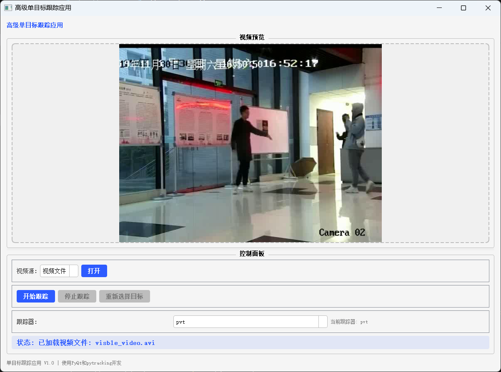
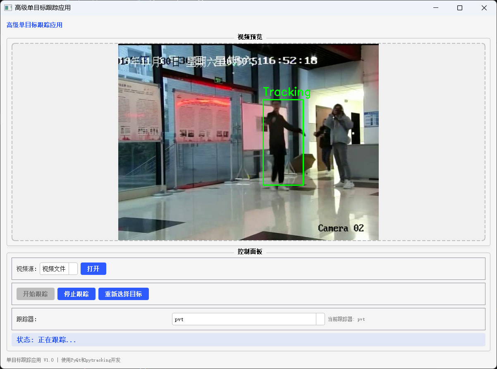
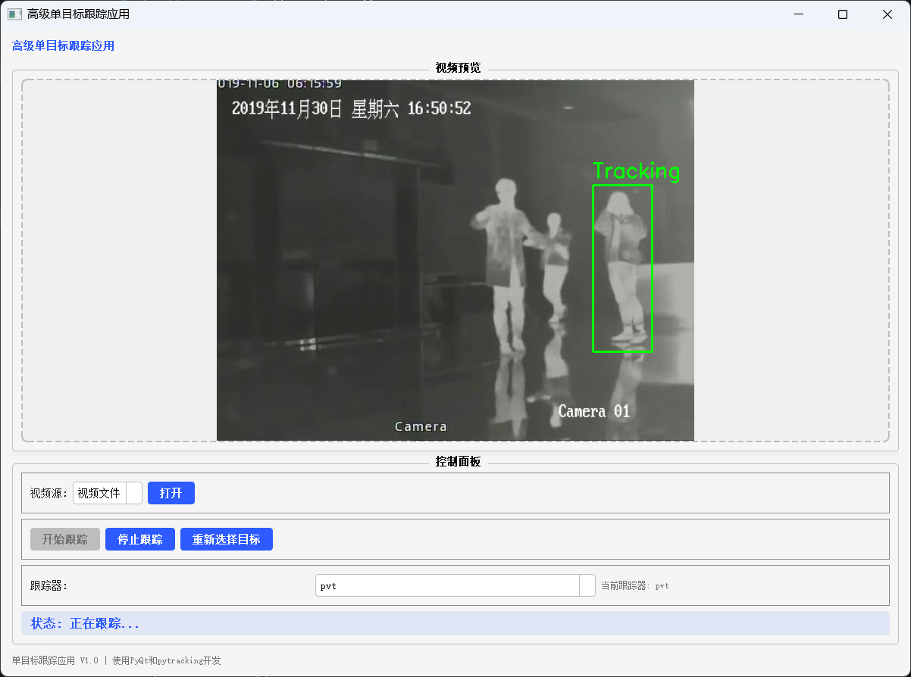

# 单目标跟踪系统

这是一个基于深度学习的单目标视觉跟踪系统，基于PYQT和pytracking开发。

---

## 项目背景与意义
该项目旨在开发一个用户友好的单目标视觉跟踪系统，在以下实际场景中应用：
- 视频监控中的目标跟踪
- 无人机跟踪拍摄
- 自动驾驶中的目标检测与跟踪
- 智能安防系统

传统方法在复杂场景下表现欠佳，而深度学习方法能够更好地处理遮挡、形变等挑战。

---

## 主流解决方案
目标跟踪的主要方法可分为：
- 基于相关滤波的方法(DCF)
- 基于孪生网络的方法(Siamese)
- 基于Transformer的方法

本项目采用基于Siamese+Transformer的方法，使用PromptVT
{https://github.com/faicaiwawa/PromptVT} 作为核心跟踪算法。

---

## 系统架构与核心算法

### 3.1 整体架构
系统主要包含以下模块：
1. **视频输入模块**
2. **目标选择模块**
3. **跟踪处理模块**
4. **结果展示模块**

### 3.2 核心算法
使用PromptVT作为核心跟踪算法，详情见{https://github.com/faicaiwawa/PromptVT}

---

## 使用说明

### 4.1 界面概述
系统采用PyQt5开发桌面GUI界面，主要功能区域包括：
- **视频预览区**：显示跟踪结果
- **控制面板**：
  - 视频源选择
  - 跟踪器选择
  - 开始/停止/重置按钮



### 4.2 操作流程
1. **选择视频源**：
   - 摄像头
   - 本地视频文件
2. **选择目标**：
   - 在视频画面中框选目标
   - 可拖拽调整选框位置和大小
3. **开始跟踪**：
   - 点击"开始跟踪"按钮
   - 系统自动追踪目标位置


---

## 实验结果

### 5.1 跟踪效果展示
不同场景下的跟踪效果：
- **RGB跟踪**：
  
- **T跟踪**：
  

### 5.2 数据集
本项目使用LasHeR数据集{https://github.com/BUGPLEASEOUT/LasHeR} 进行测试：
1. **LasHer数据集**
   - 1224个视频序列
   - 主要包含：车辆、行人、船只等目标
   - 数据结构示例：
     ```e
     sequence/
	 	├── visible
        	├── v0001.jpg
        	├── v0002.jpg
	 	├── infrared
        	├── i0001.jpg
        	├── i0002.jpg
		├── infrared.txt
		├── init.txt
        └── visible.txt
     ```
   项目中输入只支持视频文件，需要将连续图片转为视频
---

## 总结与展望
本项目实现了一个基于深度学习的单目标跟踪系统，具有以下特点：
- 采用先进算法
- 支持GPU加速
- 兼具性能和实时性

**未来工作方向：**
- 支持多目标跟踪
- 优化模型性能
- 添加更多实用功能

---
